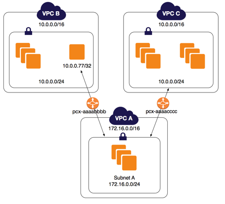
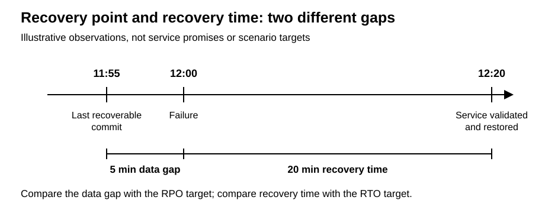
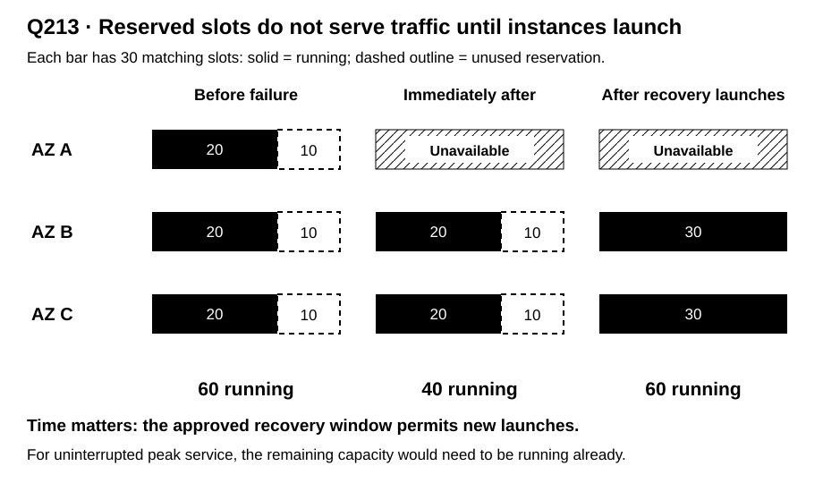
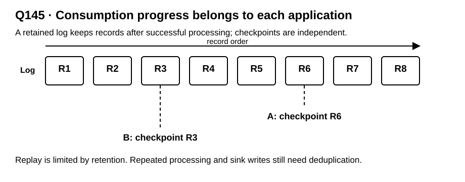
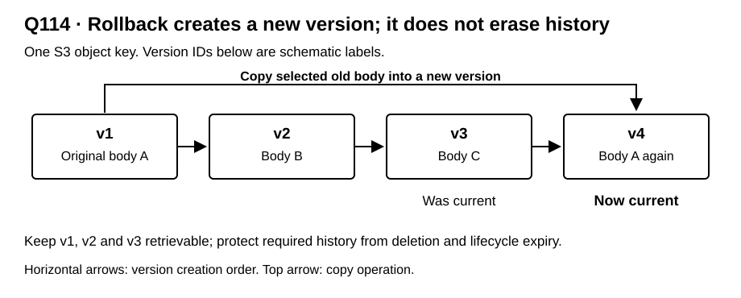
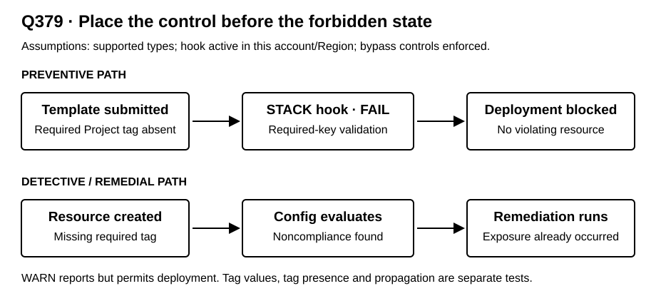

# A visual language for SAP-C02 concepts

**Question-bank audit and design specification · 18 September 2026**

The recommended approach is a **small grammar of 18 visual forms, reused across 98 concept groups**, rather than a separate drawing style for each AWS service. Architecture diagrams establish placement and connectivity. Sequences explain identity exchanges; policy tables explain authorization; timelines explain recovery and expiry; state diagrams explain retries and versions; quantitative plots expose capacity and transfer constraints.

The unit to visualize is **the distinction that changes the answer**. A drawing of S3, Lambda and DynamoDB is insufficient when the question actually turns on temporary credentials, queue visibility, a cache key, or an unavailable recovery slot.

This document includes five original SVG specimens and three additional worked visual treatments. The [question coverage appendix](visual_language_question_map.md) maps every one of the **391 questions** to a primary visual, a companion visual, and concept briefs. The [structured catalog](visual_language_coverage.json) contains the same assignments for later reuse.

## Reading paths

- For the design direction: read the findings, visual-form table and shared grammar.
- For concrete examples: read the eight worked treatments.
- For a topic: use the 98 concept briefs, grouped by subject.
- For a specific question: open the [Q001–Q391 appendix](visual_language_question_map.md).
- For authoring: use the pilot priorities, card contract and acceptance checks at the end.

## 1. Scope, evidence and audit method

The source of truth is [questions.jsonl](questions.jsonl), not an older study guide or the frequency with which AWS services happen to be mentioned. The official exam identifier is **SAP-C02**. The four domain labels in this bank match the [AWS exam guide](https://docs.aws.amazon.com/aws-certification/latest/solutions-architect-professional-02/solutions-architect-professional-02.html).

| Domain | Bank questions | Bank share | Official scored-content weighting |
|---|---:|---:|---:|
| Design Solutions for Organizational Complexity | 62 | 15.9% | 26% |
| Design for New Solutions | 131 | 33.5% | 29% |
| Continuous Improvement for Existing Solutions | 151 | 38.6% | 25% |
| Accelerate Workload Migration and Modernization | 47 | 12.0% | 20% |

The bank's distribution should not be used as the exam's weighting. It contains **75 multiple-response questions**. There is **one question-stem image**, in Q064, and **176 questions with explanation images**: 187 image references to 166 distinct paths across both locations. These counts describe available material; they are not a quality assessment of all existing images.

**Snapshot:** 391 unique IDs, `001`–`391`; SHA-256 `488a9f2151b9db823426e442c33a6b8f5ebf3243d6b6cb7f7d87091bbb126525`.

The snapshot predates the ongoing question-by-question editorial revision and PNG generation. Historical counts and concept assignments below describe that snapshot. Current editable sources, checked references and completion records are maintained in [diagrams/](diagrams/README.md).

**Method.** Parsed all records and inventoried recurring service/concept terms across stems, options and explanations. Reviewed keyed-design briefs for all IDs against the existing [question-to-rule index](aws_question_index.md); inspected complete records for ambiguous, repaired and newly distinguished concepts. Assigned a primary concept and selected supporting concepts to every question, then selected visual forms for those concepts. The existing [service guide](aws_service_decision_guide.md) helped identify comparisons and distractor vocabulary. The live JSONL took precedence wherever those aids differed. Selected official documentation was checked for consequential distinctions used in the examples and recommendations.

**Coverage means:** every question has a proposed treatment of its central distinction, and the catalog also addresses supporting concepts and recognition-level alternatives. It does not mean that every noun or every incorrect option deserves its own diagram. It is not a fresh correctness review of every answer or a claim to cover the entire official exam syllabus. The assignments are editorial hypotheses to validate with learners, not measured effects on exam performance.

## 2. Findings that shape the language

### The same services require different representations

S3 alone appears in questions about access control, signed capabilities, encryption, lifecycle, version rollback, replication, cost allocation, transfer and cache publication. A single S3 architecture stencil cannot teach all of those. Conversely, the same state-transition vocabulary can explain an SQS message, a deployment, a secret rotation and a recovery procedure.

The catalog has **98 reusable concept groups**, and **317 questions are assigned multiple concepts**. A compact primary visual plus a focused companion is therefore the default. Do not combine all relevant mechanisms into a single large diagram.

### Scope, time, ownership and guarantees are the recurring hidden variables

Most misleading diagrams omit at least one of these:

| Hidden variable | Make it visible | Representative questions |
|---|---|---|
| Scope | Account/Region/AZ, policy attachment, endpoint and service boundary | Q023, Q173, Q327, Q379 |
| Identity and authority | Caller identity, role trust, grants, ceilings and resource ownership | Q116, Q221, Q269, Q365 |
| Time and ordering | Credential expiry, visibility, retention, replication lag, cutover prerequisites | Q093, Q145, Q265, Q290, Q325 |
| State and persistence | Authoritative data, immutable versions, checkpoints, ephemeral compute | Q114, Q183, Q280, Q343 |
| Capacity and units | Running versus reserved capacity; IOPS versus MiB/s; bytes versus bits | Q083, Q112, Q195, Q213 |
| Strength of claim | Required objective, measured result, service commitment and unsupported guarantee | Q076, Q235, Q302, Q363 |

### Older summaries can send the illustration in the wrong direction

The following are observed differences between the repository's current bank and its older navigation aids. The new audit follows the current questions; it does not edit those aids.

| Question | Current visual target | Why it matters |
|---|---|---|
| Q112 | Tested block-storage performance and gp3 baseline | An EFS-sharing diagram would teach the wrong interface and requirement. |
| Q114 | Version-preserving S3 rollback and scoped document access | The current question is no longer a WorkDocs product-choice question. |
| Q145 | Independent stream checkpoints, retention and replay | A generic ingest-to-warehouse pipeline hides why competing queue consumers fail. |
| Q146 | Event-time windows, late arrivals and separate freshness paths | A Firehose delivery picture alone omits the required stateful processing. |
| Q179 | Geographic business routing plus a primary writer | Geographic policy is not the same decision as minimum-latency routing. |
| Q213 | Pre-established, matching unused capacity reservations | Spot diversification and pricing commitments do not depict the supplied recovery contract. |
| Q270 | Immutable tiles, an uncached manifest and ordered publication | A shared-filesystem picture misses the version-consistency problem. |
| Q302 | Percentage commitment versus every-object deadline | The bank uses 99.9%, and explicitly rejects the hard-deadline guarantee. |
| Q379 | Required-tag policy plus a FAIL-mode CloudFormation STACK hook | A blanket statement that tag policies cannot participate in prevention would erase the tested mechanism. |
| Q390 | Raw TCP/UDP, fixed global ingress and supported consistency mode/topology | A generic WebSocket or unspecified globally consistent database diagram is insufficient. |

The two especially sensitive cases were checked against current AWS documentation: [S3 RTC](https://docs.aws.amazon.com/AmazonS3/latest/userguide/replication-time-control.html) and [required-tag IaC enforcement](https://docs.aws.amazon.com/organizations/latest/userguide/enforce-required-tag-keys-iac.html). The broader lesson is to bind a visual to the question's actual assumptions and a dated source, rather than to an old answer label.

## 3. The 18 visual forms

Use the viewer's question to choose the form. “Architecture” is not a default category for everything involving a cloud service. The final column counts this audit's **primary editorial assignments**; it totals 391 and does not count companion appearances or estimate exam importance.

| Visual form | Use it to answer | Required encoding | Primary questions |
|---|---|---|---:|
| <a id="v01"></a>**V01 · Boundary topology** | Where does it live; which scope fails? | Containment boxes and typed edges; account, Region, VPC and AZ are explicit. | 9 |
| <a id="v02"></a>**V02 · Packet or request path trace** | Can this exact request reach its destination and return? | Numbered hops plus route/rule tables; direction, protocol, ports and address translation. | 25 |
| <a id="v03"></a>**V03 · Sequence diagram** | Who calls whom, using which identity or token, in what order? | Actor lanes, numbered messages, credential changes and response/expiry annotations. | 46 |
| <a id="v04"></a>**V04 · Authorization gates and truth table** | Is this action allowed under these conditions? | Request tuple, scoped predicates, explicit deny and missing-grant cases. | 12 |
| <a id="v05"></a>**V05 · Hierarchy and responsibility matrix** | Who owns or controls what; what is inherited? | Tree plus owner/operator/requester columns; policy attachment and scope. | 23 |
| <a id="v06"></a>**V06 · State and version diagram** | What changes state; what persists? | Named states or immutable versions, guarded transitions and terminal outcomes. | 31 |
| <a id="v07"></a>**V07 · Timeline and time budget** | What expires, arrives, or becomes ready when? | A shared time axis; durations, deadlines, ordering and uncertainty. | 21 |
| <a id="v08"></a>**V08 · Workflow and swimlanes** | Which steps, gates and responsibilities complete the job? | Ordered steps, branches, handoffs, artifacts and failure/rollback paths. | 33 |
| <a id="v09"></a>**V09 · Failure-state small multiples** | What still works after a component or scope fails? | Same layout before/during/after; lost nodes, remaining paths/capacity and state. | 17 |
| <a id="v10"></a>**V10 · Constraint/comparison matrix** | Which alternatives meet every hard requirement? | Alternatives by concrete requirements; pass/fail/conditional with explanations. | 28 |
| <a id="v11"></a>**V11 · Capacity, cost or feasibility plot** | How much is needed, available or affordable? | Measured or explicitly illustrative axes, units, constraints and a feasible region. | 33 |
| <a id="v12"></a>**V12 · Typed data lineage** | What data moves, transforms or remains authoritative? | Data artifacts, transforms, storage/custody and typed edges; metadata path separate. | 33 |
| <a id="v13"></a>**V13 · Partition, keyspace or ordered-log view** | How are records located, ordered and replayed? | Sample keys/records, partition boundaries, sort order and consumer cursors. | 6 |
| <a id="v14"></a>**V14 · Dependency graph and wave plan** | What must move, exist or complete together? | Directional dependencies, critical paths, groups/waves and cutover constraints. | 9 |
| <a id="v15"></a>**V15 · Diagnostic evidence board** | Which observation distinguishes the failure mechanisms? | Symptom, hypotheses, discriminating telemetry, decision and limitation. | 28 |
| <a id="v16"></a>**V16 · Annotated code/configuration** | Which exact field or expression changes behavior? | Small valid fragment, semantic callouts and before/after input/output. | 4 |
| <a id="v17"></a>**V17 · Protocol, protection and custody layers** | Which property is protected, on which leg, by whom? | Legs/layers, trust anchors, key location, plaintext/ciphertext and termination. | 25 |
| <a id="v18"></a>**V18 · Input/output service card** | Which transformation does this service perform? | Concrete input, operation, output, latency mode and adjacent nonmatching operation. | 8 |

A decision tree is a compact variant of V10 when a few ordered binary constraints genuinely determine the choice. A truth table is better when several conditions must hold together. A timeline is better than a flowchart when elapsed time changes the answer. Plain text is best for a single exact fact with no meaningful relationship to show.

### Mermaid coverage and the remaining rendering needs

Mermaid is a suitable default for seven of these forms: boundary topology (V01), sequences (V03), states (V06), workflows (V08), lineage (V12), dependencies (V14), and simple input/output transformations (V18). Its architecture syntax supports groups, services, edges and junctions; AWS service icons can be supplied through a registered icon pack. The deployed Mermaid version and configured packs determine what a particular Markdown host can render. See the [architecture documentation](https://mermaid.js.org/syntax/architecture.html) and [icon registration documentation](https://mermaid.js.org/config/icons.html).

The other eleven forms have useful Mermaid components, but their full required encoding benefits from a companion renderer. This is a design assessment for this bank, not a claim that these concepts cannot be sketched with Mermaid primitives.

| Form | Mermaid contribution | What still needs another representation |
|---|---|---|
| V02 · Request trace | Numbered flow or sequence | Route/rule tables, changing packet fields, synchronized forward/return views |
| V04 · Authorization | Decision gates and branches | Truth tables and condition-by-condition evaluation matrices |
| V05 · Ownership | Organization or resource tree | Responsibility matrix aligned to the hierarchy |
| V07 · Time budget | Timeline, Gantt, sequence ordering | Exact elapsed-time budgets, overlapping deadlines, uncertainty intervals |
| V09 · Failure comparison | Each individual architecture or state | Matched panels with stable positions, shared legend and capacity changes |
| V10 · Constraints | Decision tree for a few binary tests | Alternatives-by-requirements comparison table with conditional cells |
| V11 · Quantities | Basic bar and line charts | Feasible regions, stacked capacity, break-even annotations and workload calculators |
| V13 · Keyspace/log | Blocks and links for records and partitions | Precisely aligned offsets, key ranges and independent consumer cursors |
| V15 · Diagnostics | Hypothesis or decision flow | Evidence board connecting observations, competing explanations and limitations |
| V16 · Code/configuration | Relationship diagram beside code | Syntax-highlighted fragments, field callouts, diffs and evaluated examples |
| V17 · Protection/custody | Trust-boundary and exchange diagrams | Aligned layers and per-leg annotations for termination, plaintext and key custody |

Use semantic HTML tables and code for text-dense comparisons, and SVG or a plotting library for layouts whose spatial or numerical precision carries meaning. Mermaid's [XY chart documentation](https://mermaid.js.org/syntax/xyChart.html) describes its basic quantitative chart facilities. Interactive policy toggles, failure simulations, cursor stepping and calculators require application logic regardless of the static diagram renderer. Mermaid's packet diagram describes a packet's fields; it is not a route simulator.

## 4. Shared grammar: what the marks mean

### Stable nouns and relationships

| Element | Proposed convention | Semantic rule |
|---|---|---|
| Service/resource | Labeled rectangle; official icon optional inside it | The name remains readable without recognizing the icon. Distinguish a service from an individual resource. |
| Actor/principal | Labeled actor card | State human, workload role, service principal or assumed-role session explicitly. |
| Data artifact | Document/table/record card | Label format, key, version, sensitivity and authoritative/derived status when relevant. |
| Scope | Named containment boundary | Separate account and Region dimensions; show VPC/AZ placement only where it actually applies. Use lanes/matrices when one nested hierarchy would be false. |
| Directed relationship | Arrow with an explicit verb and object | “AssumeRole”, “GET object”, “replicate asynchronously”, “authorize association”; avoid unlabeled “uses” arrows. |
| Configuration/control relationship | Dashed arrow with a label | Do not confuse policy attachment, provisioning or monitoring with application data flow. |
| Time | Left to right in timelines; top to bottom in sequences | The axis is meaningful only in these views. A node's position in a topology is not a time assertion. |
| Failure | Cross/hatching plus a status label | Keep the healthy layout and explicitly show the remaining route/capacity/state. |
| Conditional claim | “Conditional” badge plus condition text | Absence of a condition is never an implicit guarantee. |
| Quantitative magnitude | Position or length on a labeled scale | No unlabeled arrow thickness, arbitrary bubble size or invented “performance score”. |

Use [official AWS architecture icons](https://aws.amazon.com/architecture/icons/) for recognition in topology views. Their category colors should remain separate from the visual language's status semantics. A purple database icon must not mean “healthy”, “trusted” or “replicated”. Keep a versioned icon set if the language is implemented.

**Accessibility and density.** Use labels, line styles and shapes in addition to color. Aim for text contrast of at least 4.5:1 and meaningful graphical contrast of at least 3:1. Start with monochrome structure; add semantic color only if it improves decoding. The specimens below deliberately remain legible without color. On a phone, present one mechanism per card and convert large matrices to focused comparisons; do not shrink an entire architecture until labels become unreadable.

### Separate planes without losing their relationship

A common question needs three coordinated views:

1. **Placement/connectivity:** where the resource is and how packets reach it.
2. **Authority/control:** who can configure or call it, and which policy governs the action.
3. **State/time:** what changes, persists, expires or must finish first.

For Q006/Q374, these become a private request path, a scoped authorization table and an object-access operation. Connecting a VPC endpoint to an S3 icon alone does not establish all three. For Q325, the topology locates the standby, the workflow promotes/scales it, and the timeline measures readiness before traffic moves.

### Design against the actual distractor

Use paired views that change **one decisive property** while keeping the rest stable: same resources but wrong policy owner; same queue but wrong redrive count; same replicas but no promotion; same capacity limit but no capacity reservation. Ask the learner to predict the outcome before revealing the annotation. Avoid a green “correct architecture” beside a completely different red arrangement with no explanation of the causal difference.

For multiple-response questions, use a requirement-to-mechanism matrix. Distinguish individually necessary components, alternatives, dependencies and the combination that is sufficient **under the stated assumptions**. Reference stable option IDs in any future interactive data; do not embed display letters that change when options are shuffled.

## 5. Eight worked visual treatments

These are specimens of the grammar, not a finished illustration library for every question. SVGs are editable vector sources; each has a title and textual description. Tables provide exact details that an image alone would obscure.

### A. Architecture plus packet trace: Q064

The bank already supplies a useful topology:



Add the missing behavioral view, with the same address labels:

| Request from A | Matching routes in A | Winning next hop | Necessary return route |
|---|---|---|---|
| `10.0.0.77` | `10.0.0.77/32`, `10.0.0.0/16` | `/32` → B (`pcx-aaaabbbb`) | B → `172.16.0.0/16` via A–B peering |
| `10.0.0.88` | `10.0.0.0/16` | `/16` → C (`pcx-aaaacccc`) | C → `172.16.0.0/16` via A–C peering |

**Teaching action:** choose a destination, highlight matching rows and the longest prefix, then reveal the return packet. The fact that B and C overlap does not make either overlap A; the diagram must not imply B–C transit. The scenario supplies permissive SG/NACL assumptions. See [C20](#c20).

### B. Authorization as a scoped checklist: Q221

Model the specific cross-account encrypted-object request as four checks, under the scenario's assumptions and with no overriding deny:

| Caller policy: S3 read | Bucket grants external role | Caller policy: decrypt | Key policy permits external role | Outcome in this example |
|---|---|---|---|---|
| Yes | Yes | Yes | Yes | Required permissions present |
| Yes | Yes | No | Yes | Decryption authorization incomplete |
| Yes | No | Yes | Yes | Cross-account object authorization incomplete |
| Yes | Yes | Yes | No | Cross-account key authorization incomplete |

**Teaching action:** remove one permission and name which action fails. Pair this with an account-ownership view so the learner knows where each policy belongs. This is a Q221-specific checklist, not a universal IAM evaluation algorithm; applicable explicit denies and other ceilings still matter. AWS documents distinct evaluation rules for [policy types and contexts](https://docs.aws.amazon.com/IAM/latest/UserGuide/reference_policies_evaluation-logic.html). See [C01](#c01), [C02](#c02), [C48](#c48).

### C. Recovery measurements: Q027, Q229, Q363



**Teaching action:** move the latest recoverable commit without moving service-restoration time, then do the reverse. That isolates the two concepts. Add a second lane for restore/provision/promote/reconnect/validate/route tasks when explaining why a particular recovery strategy fits. The numbers in this specimen are **illustrative**, not values copied from one question. AWS's [DR strategy guidance](https://docs.aws.amazon.com/whitepapers/latest/disaster-recovery-workloads-on-aws/disaster-recovery-options-in-the-cloud.html) distinguishes recovery approaches and stresses testing. See [C89](#c89).

### D. Capacity through a failure: Q213



**Teaching action:** hide the reserved-slot layer and ask whether “ASG maximum 90” or a Savings Plan fills the gap. Then reveal the difference between permitted scaling and available capacity. In the live scenario, each surviving AZ supplies 20 running plus 10 newly launched instances: `2 × (20 + 10) = 60`. This is consistent with the stated recovery window, not uninterrupted peak operation. [EC2 Capacity Reservations](https://docs.aws.amazon.com/AWSEC2/latest/UserGuide/ec2-capacity-reservations.html) reserve matching capacity in a specific AZ. See [C36](#c36).

### E. Retained log versus queue: Q145



**Teaching action:** replay records for consumer A while preserving B's checkpoint. Compare against a one-queue/two-worker view in which successful deletion removes the message rather than advancing a persistent independent cursor. The selected stream retains seven days in Q145; the eight boxes are schematic records, not hours or shards. Partition ordering and sink idempotency require their own annotations. See [Kinesis stream concepts](https://docs.aws.amazon.com/streams/latest/dev/key-concepts.html) and [C63](#c63).

### F. Version-preserving rollback: Q114



**Teaching action:** choose an old body, create a new current version and confirm that intervening history survives. A second card shows the application's tenant authorization and version-scoped presigned request. The version labels are schematic, not literal S3 version IDs. AWS describes [restoring by copying a previous version](https://docs.aws.amazon.com/AmazonS3/latest/userguide/RestoringPreviousVersions.html). See [C47](#c47).

### G. Prevention versus later remediation: Q379



**Teaching action:** switch the hook from FAIL to WARN, omit its account/Region activation, or allow an uncontrolled direct API path. Each changes a distinct precondition. The hook's placement in time explains why it addresses this question; its product name alone does not. AWS documents the [required-tag stack-hook integration](https://docs.aws.amazon.com/organizations/latest/userguide/enforce-required-tag-keys-iac.html). See [C10](#c10), [C72](#c72).

### H. Transfer feasibility before architecture choice: Q195

| Quantity | Lower-bound calculation, decimal units |
|---|---|
| Data | `60 TB × 10^12 bytes/TB × 8 bits/byte = 480 × 10^12 bits` |
| Best-case link time | `480 × 10^12 / (50 × 10^6 bits/s) = 9,600,000 s ≈ 111.1 days` |
| Best-case data moved in 30 days | `50 × 10^6 × 30 × 86,400 / 8 ≈ 16.2 TB` |
| Gap | At least `43.8 TB`, before protocol overhead and operational limits |

**Visual treatment:** cumulative transferred TB on the vertical axis and days on the horizontal axis; draw the optimistic 50-Mbps line, a 30-day deadline and a 60-TB target. Their failure to intersect inside the deadline eliminates the ordinary WAN-only initial copy. A second swimlane must still account for export, Data Transfer Terminal availability/logistics, load, coordinated CDC and validation. The arithmetic rejects one plan; it does not prove that the alternative is automatically feasible. See [C86](#c86), [C87](#c87).

## 6. Concept-by-concept catalog

Each brief gives a primary form, a companion, required content and a misconception to avoid. Linked-question counts include both primary and supporting assignments and therefore overlap. Examples are the first six linked IDs in source order; the [coverage appendix](visual_language_question_map.md) contains every assignment.

### Identity and authorization

<a id="c01"></a>
**C01 · Policy evaluation and permission ceilings** — [V04](#v04) + [V05](#v05). 9 linked questions; examples: [Q006](visual_language_question_map.md#q006), [Q075](visual_language_question_map.md#q075), [Q101](visual_language_question_map.md#q101), [Q116](visual_language_question_map.md#q116), [Q133](visual_language_question_map.md#q133), [Q188](visual_language_question_map.md#q188).

**Draw:** Render a request tuple (principal, action, resource, context), applicable grants, ceilings and explicit denies as an evaluation table. Include one allowed and one denied request.

**Do not imply:** A universal intersection-of-all-policies Venn diagram is wrong; same-account resource grants, role sessions and cross-account requests have different rules.

<a id="c02"></a>
**C02 · Role trust and cross-account assumption** — [V03](#v03) + [V04](#v04). 16 linked questions; examples: [Q008](visual_language_question_map.md#q008), [Q053](visual_language_question_map.md#q053), [Q116](visual_language_question_map.md#q116), [Q122](visual_language_question_map.md#q122), [Q123](visual_language_question_map.md#q123), [Q139](visual_language_question_map.md#q139).

**Draw:** Use account swimlanes: source principal, STS, target role, target resource. Number AssumeRole and resource calls separately; attach trust and permissions to their owners. Include ExternalId where relevant.

**Do not imply:** Trust in a role is not permission to read its resources; consolidated billing creates neither trust nor an administrative session.

<a id="c03"></a>
**C03 · Federation and identity/token exchange** — [V03](#v03) + [V10](#v10). 16 linked questions; examples: [Q022](visual_language_question_map.md#q022), [Q038](visual_language_question_map.md#q038), [Q050](visual_language_question_map.md#q050), [Q053](visual_language_question_map.md#q053), [Q084](visual_language_question_map.md#q084), [Q099](visual_language_question_map.md#q099).

**Draw:** Draw the identity presented at each hop: LDAP authentication, SAML assertion, OIDC token, user-pool token or temporary AWS credentials. Compare workforce Identity Center with customer Cognito and broker patterns.

**Do not imply:** An authentication token is not automatically an AWS credential; APIs accepted by one STS caller credential type need not accept another.

<a id="c04"></a>
**C04 · ABAC, tag predicates and policy conditions** — [V04](#v04) + [V16](#v16). 15 linked questions; examples: [Q013](visual_language_question_map.md#q013), [Q119](visual_language_question_map.md#q119), [Q131](visual_language_question_map.md#q131), [Q133](visual_language_question_map.md#q133), [Q139](visual_language_question_map.md#q139), [Q180](visual_language_question_map.md#q180).

**Draw:** Use a principal-tag/resource-prefix matching table and an annotated condition block. Test missing, empty, valid, invalid and attacker-modified tags; distinguish bucket and object actions.

**Do not imply:** Testing submitted tag keys does not prove that every required key exists. Show trusted attribute provenance and protection against retagging.

<a id="c05"></a>
**C05 · Signed requests and expiring access capabilities** — [V03](#v03) + [V07](#v07). 12 linked questions; examples: [Q002](visual_language_question_map.md#q002), [Q044](visual_language_question_map.md#q044), [Q069](visual_language_question_map.md#q069), [Q084](visual_language_question_map.md#q084), [Q099](visual_language_question_map.md#q099), [Q114](visual_language_question_map.md#q114).

**Draw:** Draw signer, authorization check, URL or SigV4 request, and object/API call. Add operation, resource/version, expiry and underlying credential-expiry bands.

**Do not imply:** A presigned URL is a transferable bearer capability; signing a GET requires the relevant read permissions and can expire before its nominal URL lifetime.

<a id="c06"></a>
**C06 · Workload roles and credential delivery** — [V05](#v05) + [V03](#v03). 11 linked questions; examples: [Q056](visual_language_question_map.md#q056), [Q107](visual_language_question_map.md#q107), [Q113](visual_language_question_map.md#q113), [Q126](visual_language_question_map.md#q126), [Q130](visual_language_question_map.md#q130), [Q141](visual_language_question_map.md#q141).

**Draw:** Use a responsibility matrix for EC2 role/profile, ECS execution role, ECS task role and application. A short sequence shows metadata/SDK credentials or startup secret retrieval.

**Do not imply:** The container execution role is not the running application's task role; an instance profile belongs to its own account.

<a id="c07"></a>
**C07 · Directory trust, SSO and provisioning** — [V03](#v03) + [V05](#v05). 6 linked questions; examples: [Q212](visual_language_question_map.md#q212), [Q223](visual_language_question_map.md#q223), [Q224](visual_language_question_map.md#q224), [Q225](visual_language_question_map.md#q225), [Q329](visual_language_question_map.md#q329), [Q349](visual_language_question_map.md#q349).

**Draw:** Separate directory trust, SAML sign-in, SCIM user/group provisioning, permission-set assignment and VPN MFA into labeled lanes. Name the directory owner and trust direction.

**Do not imply:** A directory proxy is not a new AD forest, provisioning is not authentication, and directory authentication does not supply VPN routes.

### Organization and economics

<a id="c08"></a>
**C08 · Organization hierarchy and SCP scope** — [V05](#v05) + [V04](#v04). 20 linked questions; examples: [Q042](visual_language_question_map.md#q042), [Q088](visual_language_question_map.md#q088), [Q162](visual_language_question_map.md#q162), [Q171](visual_language_question_map.md#q171), [Q172](visual_language_question_map.md#q172), [Q173](visual_language_question_map.md#q173).

**Draw:** Draw root, OUs and accounts as a policy inheritance tree. Evaluate one concrete action along its path; mark management-account and service-linked-role scope exceptions.

**Do not imply:** A child allow cannot cancel an inherited explicit deny. An SCP ceiling does not create the missing IAM grant.

<a id="c09"></a>
**C09 · Resource sharing and ownership** — [V05](#v05) + [V01](#v01). 7 linked questions; examples: [Q024](visual_language_question_map.md#q024), [Q061](visual_language_question_map.md#q061), [Q171](visual_language_question_map.md#q171), [Q256](visual_language_question_map.md#q256), [Q283](visual_language_question_map.md#q283), [Q327](visual_language_question_map.md#q327).

**Draw:** Pair a two-account resource-sharing diagram with owner/participant/management responsibility columns. Show RAM share, association/attachment and routing as separate operations.

**Do not imply:** Sharing a subnet or transit gateway does not transfer all networking administration to the participant or automatically create connectivity.

<a id="c10"></a>
**C10 · Tagging enforcement and propagation** — [V08](#v08) + [V04](#v04). 8 linked questions; examples: [Q087](visual_language_question_map.md#q087), [Q186](visual_language_question_map.md#q186), [Q192](visual_language_question_map.md#q192), [Q207](visual_language_question_map.md#q207), [Q240](visual_language_question_map.md#q240), [Q330](visual_language_question_map.md#q330).

**Draw:** Use before-create and after-create lanes for tag policy, request-tag control, CloudFormation required-tag hook and Config. Add a resource-by-tag propagation table and FAIL/WARN outcomes.

**Do not imply:** Scope the mechanism to supported APIs/types and activated accounts/Regions; checking a stack tag is not proving every resource has it.

<a id="c11"></a>
**C11 · Approved self-service provisioning** — [V05](#v05) + [V08](#v08). 4 linked questions; examples: [Q174](visual_language_question_map.md#q174), [Q186](visual_language_question_map.md#q186), [Q207](visual_language_question_map.md#q207), [Q255](visual_language_question_map.md#q255).

**Draw:** Draw requester, Service Catalog product/version, launch constraint role and created resources. Display allowed parameters, encryption, propagated tags and output URL as a contract.

**Do not imply:** The requester does not need every underlying provisioning permission; a portfolio icon alone says nothing about parameter or launch constraints.

<a id="c12"></a>
**C12 · Billing attribution, budgets and reporting** — [V12](#v12) + [V10](#v10). 6 linked questions; examples: [Q087](visual_language_question_map.md#q087), [Q205](visual_language_question_map.md#q205), [Q249](visual_language_question_map.md#q249), [Q330](visual_language_question_map.md#q330), [Q331](visual_language_question_map.md#q331), [Q346](visual_language_question_map.md#q346).

**Draw:** Trace resource tags through billing activation to CUR, account-to-OU join, Athena and authorized QuickSight views. Compare historical analysis, threshold alerts and report delivery.

**Do not imply:** Tagging is not billing activation; OU membership needs a join, and a dashboard or saved view is not an automated report delivery workflow.

<a id="c13"></a>
**C13 · Commitment, elasticity and cost allocation** — [V11](#v11) + [V10](#v10). 15 linked questions; examples: [Q012](visual_language_question_map.md#q012), [Q031](visual_language_question_map.md#q031), [Q083](visual_language_question_map.md#q083), [Q157](visual_language_question_map.md#q157), [Q162](visual_language_question_map.md#q162), [Q164](visual_language_question_map.md#q164).

**Draw:** Plot demand over time with a committed baseline and elastic excess. Add a compatibility matrix for EC2/Compute Savings Plans, RIs, database reservations and Requester Pays cost ownership.

**Do not imply:** A billing discount is not spare launch capacity; match service, Region, family and sharing scope before drawing savings.

<a id="c14"></a>
**C14 · Quotas and utilization thresholds** — [V11](#v11) + [V16](#v16). 2 linked questions; examples: [Q040](visual_language_question_map.md#q040), [Q301](visual_language_question_map.md#q301).

**Draw:** Show usage and quota in the same unit, a derived utilization ratio and the alarm threshold. Annotate SERVICE_QUOTA expression, dimension and notification path.

**Do not imply:** A service quota is not a budget or a scaling target; task count and vCPU usage cannot share a denominator.

### Network and DNS

<a id="c15"></a>
**C15 · Subnet ingress, NAT and private egress** — [V02](#v02) + [V01](#v01). 7 linked questions; examples: [Q005](visual_language_question_map.md#q005), [Q016](visual_language_question_map.md#q016), [Q025](visual_language_question_map.md#q025), [Q060](visual_language_question_map.md#q060), [Q182](visual_language_question_map.md#q182), [Q268](visual_language_question_map.md#q268).

**Draw:** Trace one outbound request and its return through the private-subnet route, AZ-local NAT, public-subnet route and internet gateway. Show container image/secret/log dependencies explicitly.

**Do not imply:** A private subnet label is not evidence that bootstrap dependencies are reachable; a public IP is not a substitute for the required route.

<a id="c16"></a>
**C16 · Private endpoints and service exposure** — [V02](#v02) + [V04](#v04). 7 linked questions; examples: [Q006](visual_language_question_map.md#q006), [Q046](visual_language_question_map.md#q046), [Q246](visual_language_question_map.md#q246), [Q367](visual_language_question_map.md#q367), [Q374](visual_language_question_map.md#q374), [Q378](visual_language_question_map.md#q378).

**Draw:** Use a provider/consumer boundary diagram for gateway endpoints, interface endpoints, PrivateLink and S3 access points. Place endpoint, identity and resource policy gates beside the request path.

**Do not imply:** Private transport is not authorization. Managed S3/DynamoDB services are outside the VPC even when their access path is private.

<a id="c17"></a>
**C17 · Transit routing, segmentation and inspection** — [V02](#v02) + [V05](#v05). 8 linked questions; examples: [Q016](visual_language_question_map.md#q016), [Q061](visual_language_question_map.md#q061), [Q138](visual_language_question_map.md#q138), [Q256](visual_language_question_map.md#q256), [Q327](visual_language_question_map.md#q327), [Q354](visual_language_question_map.md#q354).

**Draw:** Pair spoke/TGW/inspection topology with attachment-to-route-table association and propagation tables. Trace forward and return packets through Network Firewall or GWLB endpoints.

**Do not imply:** A hub drawing does not prove transit, segmentation or symmetric inspection; distinguish GWLB appliances from native Network Firewall endpoints.

<a id="c18"></a>
**C18 · Hybrid connectivity and failure domains** — [V09](#v09) + [V01](#v01). 12 linked questions; examples: [Q010](visual_language_question_map.md#q010), [Q068](visual_language_question_map.md#q068), [Q103](visual_language_question_map.md#q103), [Q118](visual_language_question_map.md#q118), [Q121](visual_language_question_map.md#q121), [Q138](visual_language_question_map.md#q138).

**Draw:** Use small multiples for normal, circuit-loss, router-loss and site-loss states. Label DX/VPN links, customer gateways, locations and remaining throughput.

**Do not imply:** Two tunnels or links sharing a device/site are not independent failure domains. A VPN backup need not match DX throughput.

<a id="c19"></a>
**C19 · DX gateways, VIFs and BGP advertisements** — [V02](#v02) + [V16](#v16). 5 linked questions; examples: [Q103](visual_language_question_map.md#q103), [Q177](visual_language_question_map.md#q177), [Q197](visual_language_question_map.md#q197), [Q243](visual_language_question_map.md#q243), [Q356](visual_language_question_map.md#q356).

**Draw:** Draw the physical connection, VIF, DX gateway and VGW/TGW association as distinct objects. Add a prefix advertisement/filter table and BGP prerequisites.

**Do not imply:** A DX gateway is not arbitrary VPC-to-VPC transit; VGW filtering and TGW allowed-prefix advertisement have different semantics.

<a id="c20"></a>
**C20 · CIDR overlap and longest-prefix routing** — [V02](#v02) + [V13](#v13). 1 linked questions; examples: [Q064](visual_language_question_map.md#q064).

**Draw:** Draw address intervals and a concrete destination lookup beside the topology. Highlight the winning /32 versus /16 row and show the return route.

**Do not imply:** Address overlap between two separate spokes does not by itself invalidate each spoke's nonoverlapping peering with the hub; peering remains nontransitive.

<a id="c21"></a>
**C21 · Security-group and NACL packet decisions** — [V02](#v02) + [V04](#v04). 14 linked questions; examples: [Q019](visual_language_question_map.md#q019), [Q046](visual_language_question_map.md#q046), [Q064](visual_language_question_map.md#q064), [Q135](visual_language_question_map.md#q135), [Q143](visual_language_question_map.md#q143), [Q155](visual_language_question_map.md#q155).

**Draw:** Trace source/destination, listener/target port and return ephemeral ports through SG and NACL tables. Show SG reference identity and the actual source address at each hop.

**Do not imply:** SGs are stateful allow rules; NACLs are ordered stateless rules. Health checks can require a protocol different from application traffic.

<a id="c22"></a>
**C22 · Private DNS and hybrid resolution** — [V03](#v03) + [V01](#v01). 9 linked questions; examples: [Q024](visual_language_question_map.md#q024), [Q036](visual_language_question_map.md#q036), [Q054](visual_language_question_map.md#q054), [Q137](visual_language_question_map.md#q137), [Q150](visual_language_question_map.md#q150), [Q199](visual_language_question_map.md#q199).

**Draw:** Follow a named DNS query through the VPC resolver, associated private zone or outbound forwarding rule, and authoritative server. Pair cross-account association with an owner sequence.

**Do not imply:** Name resolution and packet connectivity are separate; private-zone association does not require peering merely to resolve names.

<a id="c23"></a>
**C23 · Geographic routing, health and access restriction** — [V10](#v10) + [V09](#v09). 9 linked questions; examples: [Q007](visual_language_question_map.md#q007), [Q096](visual_language_question_map.md#q096), [Q125](visual_language_question_map.md#q125), [Q179](visual_language_question_map.md#q179), [Q185](visual_language_question_map.md#q185), [Q262](visual_language_question_map.md#q262).

**Draw:** Compare geographic business rules, latency selection, failover health and country blocking. Use normal/failure snapshots with the actual routing decision and fallback.

**Do not imply:** Geolocation routing is not authorization, and DNS changes do not relocate session state or existing connections.

<a id="c24"></a>
**C24 · Remote-user VPN access** — [V03](#v03) + [V02](#v02). 4 linked questions; examples: [Q067](visual_language_question_map.md#q067), [Q163](visual_language_question_map.md#q163), [Q268](visual_language_question_map.md#q268), [Q349](visual_language_question_map.md#q349).

**Draw:** Show certificate and user authentication, MFA, authorization rule, endpoint association and route as separate prerequisites. Then trace the private application request.

**Do not imply:** Successful login does not prove authorization or reachability; distinguish Client VPN from site-to-site connectivity.

<a id="c25"></a>
**C25 · Connection lifetime and keepalive** — [V07](#v07) + [V06](#v06). 1 linked questions; examples: [Q093](visual_language_question_map.md#q093).

**Draw:** Draw last payload, idle interval, keepalive probes, idle expiry, reset and reconnect on a scaled timeline. Label units and the boundary condition.

**Do not imply:** A long-idle connection failure is not evidence of bandwidth exhaustion; increasing capacity does not change connection lifetime.

### Edge, APIs and cryptography

<a id="c26"></a>
**C26 · TLS legs, certificate scope and termination** — [V17](#v17) + [V01](#v01). 11 linked questions; examples: [Q001](visual_language_question_map.md#q001), [Q023](visual_language_question_map.md#q023), [Q056](visual_language_question_map.md#q056), [Q057](visual_language_question_map.md#q057), [Q071](visual_language_question_map.md#q071), [Q072](visual_language_question_map.md#q072).

**Draw:** Split viewer-to-edge and edge-to-origin TLS legs. Label hostname, certificate location, termination owner, SNI and protocol policy on each leg.

**Do not imply:** One HTTPS padlock does not prove both legs are encrypted; viewer and origin certificates have different scope requirements.

<a id="c27"></a>
**C27 · DNSSEC and transport security properties** — [V17](#v17) + [V03](#v03). 1 linked questions; examples: [Q001](visual_language_question_map.md#q001).

**Draw:** Draw DNS signing/validation and HTTPS as parallel protection tracks. Mark authenticity, integrity, confidentiality and downgrade prevention as separate properties.

**Do not imply:** DNSSEC does not encrypt DNS and SNI does not add encryption. Keep HSTS/first-visit behavior distinct from an HTTP redirect.

<a id="c28"></a>
**C28 · Caching, origins and delivery paths** — [V12](#v12) + [V10](#v10). 22 linked questions; examples: [Q011](visual_language_question_map.md#q011), [Q017](visual_language_question_map.md#q017), [Q022](visual_language_question_map.md#q022), [Q051](visual_language_question_map.md#q051), [Q055](visual_language_question_map.md#q055), [Q094](visual_language_question_map.md#q094).

**Draw:** Trace static/dynamic paths, cache hit/miss, origin selection and TTL. Label S3 REST versus website endpoints and show an on-premises origin when migration is not required.

**Do not imply:** A CDN need not imply origin migration; cache only reusable responses, and a website endpoint is not a private OAC REST origin.

<a id="c29"></a>
**C29 · Versioned publication and freshness** — [V06](#v06) + [V07](#v07). 1 linked questions; examples: [Q270](visual_language_question_map.md#q270).

**Draw:** Show immutable tile versions, completion verification, publication of a latest manifest and client version pinning. Use separate cache policies for manifest and tiles.

**Do not imply:** A TTL is not a synchronized publication barrier; S3 object versioning does not automatically change a CDN URL cache key.

<a id="c30"></a>
**C30 · Edge execution and cache-key equivalence** — [V16](#v16) + [V03](#v03). 5 linked questions; examples: [Q271](visual_language_question_map.md#q271), [Q273](visual_language_question_map.md#q273), [Q274](visual_language_question_map.md#q274), [Q361](visual_language_question_map.md#q361), [Q380](visual_language_question_map.md#q380).

**Draw:** Use before/after request cards for query normalization or device variants, followed by cache-key computation. Mark viewer/origin event stage and runtime capability constraints.

**Do not imply:** Do not lowercase semantically case-sensitive values or omit the variant from the key; JWT verification differs from the login exchange.

<a id="c31"></a>
**C31 · Viewer authorization and origin protection** — [V04](#v04) + [V02](#v02). 12 linked questions; examples: [Q007](visual_language_question_map.md#q007), [Q091](visual_language_question_map.md#q091), [Q095](visual_language_question_map.md#q095), [Q234](visual_language_question_map.md#q234), [Q270](visual_language_question_map.md#q270), [Q275](visual_language_question_map.md#q275).

**Draw:** Draw two separate gates: viewer eligibility and origin access. Include OAC service principal/distribution condition, or validated secret header for the relevant custom origin.

**Do not imply:** Signed viewer URLs do not prevent direct origin bypass by themselves; OAI and OAC are different policy models.

<a id="c32"></a>
**C32 · Ingress protocol and address requirements** — [V10](#v10) + [V02](#v02). 8 linked questions; examples: [Q037](visual_language_question_map.md#q037), [Q127](visual_language_question_map.md#q127), [Q150](visual_language_question_map.md#q150), [Q262](visual_language_question_map.md#q262), [Q292](visual_language_question_map.md#q292), [Q358](visual_language_question_map.md#q358).

**Draw:** Build a matrix for ALB, NLB, Global Accelerator, Route 53 and API entry points with raw TCP, UDP, HTTP, WebSocket, static global addresses and health behavior.

**Do not imply:** Port number alone does not select a transport load balancer. Global address stability, regional balancing and DNS selection are separate requirements.

<a id="c33"></a>
**C33 · Key custody and HSM-backed TLS** — [V17](#v17) + [V05](#v05). 2 linked questions; examples: [Q039](visual_language_question_map.md#q039), [Q045](visual_language_question_map.md#q045).

**Draw:** Draw key-operation boundaries: private key stays in HSM, web server performs the TLS integration, load balancer passes TCP through. Separate payload flow from cryptographic operations.

**Do not imply:** A padlock hides who can extract or use a key; encryption in transit and encrypted log storage need separate configurations.

<a id="c34"></a>
**C34 · API invocation, subscriptions and push** — [V03](#v03) + [V10](#v10). 7 linked questions; examples: [Q010](visual_language_question_map.md#q010), [Q044](visual_language_question_map.md#q044), [Q115](visual_language_question_map.md#q115), [Q167](visual_language_question_map.md#q167), [Q335](visual_language_question_map.md#q335), [Q341](visual_language_question_map.md#q341).

**Draw:** Use request/response versus subscription/push sequences for API Gateway, AppSync, WebSocket callbacks and Function URLs. Include authentication and authorization explicitly.

**Do not imply:** An API key is not user authentication; a WebSocket connection needs the correct server-to-client callback operation.

<a id="c95"></a>
**C95 · Field-level confidentiality through intermediaries** — [V17](#v17) + [V12](#v12). 1 linked questions; examples: [Q313](visual_language_question_map.md#q313).

**Draw:** Draw a sample request with ordinary fields and selected encrypted fields. Track which proxy, application component and final processor can read each field, separately from each TLS leg.

**Do not imply:** Transport decryption at an intermediary need not expose application-encrypted fields; encryption does not make a response safe to cache for all viewers.

### Compute and resilience

<a id="c35"></a>
**C35 · Tier-level availability and scale boundaries** — [V09](#v09) + [V01](#v01). 22 linked questions; examples: [Q005](visual_language_question_map.md#q005), [Q026](visual_language_question_map.md#q026), [Q030](visual_language_question_map.md#q030), [Q037](visual_language_question_map.md#q037), [Q051](visual_language_question_map.md#q051), [Q062](visual_language_question_map.md#q062).

**Draw:** Draw application and database tiers with independent failure/scaling boundaries. Compare healthy and one-AZ-down states, showing traffic and durable state.

**Do not imply:** An ASG, load balancer and database each solve different failure paths; multiple boxes alone do not establish sufficient capacity.

<a id="c36"></a>
**C36 · Running headroom versus reserved recovery capacity** — [V11](#v11) + [V09](#v09). 3 linked questions; examples: [Q083](visual_language_question_map.md#q083), [Q213](visual_language_question_map.md#q213), [Q390](visual_language_question_map.md#q390).

**Draw:** Show AZ capacity as occupied, unused reserved and unavailable slots. Compare before failure, immediate survivors and post-recovery capacity, with recovery time explicit.

**Do not imply:** Do not equate quota, ASG maximum, billing commitment, reserved slots and already-running capacity.

<a id="c37"></a>
**C37 · Scaling signals and bottleneck diagnosis** — [V15](#v15) + [V11](#v11). 10 linked questions; examples: [Q012](visual_language_question_map.md#q012), [Q047](visual_language_question_map.md#q047), [Q160](visual_language_question_map.md#q160), [Q250](visual_language_question_map.md#q250), [Q261](visual_language_question_map.md#q261), [Q284](visual_language_question_map.md#q284).

**Draw:** Draw demand, queue depth, latency, CPU and downstream capacity as a cause/evidence graph; then show the control loop and scaling action. Label scheduled versus reactive scaling.

**Do not imply:** Adding capacity to the wrong tier can increase throttling or replacement storms. Correlation alone does not identify the bottleneck.

<a id="c38"></a>
**C38 · Runtime, container placement and portability** — [V10](#v10) + [V01](#v01). 10 linked questions; examples: [Q156](visual_language_question_map.md#q156), [Q228](visual_language_question_map.md#q228), [Q253](visual_language_question_map.md#q253), [Q277](visual_language_question_map.md#q277), [Q341](visual_language_question_map.md#q341), [Q342](visual_language_question_map.md#q342).

**Draw:** Compare EC2, Lambda, ECS/Fargate, ECS Anywhere and EKS by duration, host control, portability, network and operational constraints. Show where orchestration and tasks actually run.

**Do not imply:** Container packaging is not a guarantee of runtime fit; Fargate does not run on arbitrary on-premises hosts.

<a id="c39"></a>
**C39 · Container startup and task isolation** — [V05](#v05) + [V03](#v03). 6 linked questions; examples: [Q025](visual_language_question_map.md#q025), [Q141](visual_language_question_map.md#q141), [Q144](visual_language_question_map.md#q144), [Q242](visual_language_question_map.md#q242), [Q246](visual_language_question_map.md#q246), [Q253](visual_language_question_map.md#q253).

**Draw:** Separate image pull, secret injection and logging at startup from runtime application calls. Label task ENI/SG, execution-role permissions and task-role permissions.

**Do not imply:** Network isolation and IAM isolation are independent. A correct secret ARN cannot fix a wrong writer endpoint or blocked database port.

<a id="c40"></a>
**C40 · Interruptible work and graceful termination** — [V06](#v06) + [V08](#v08). 11 linked questions; examples: [Q031](visual_language_question_map.md#q031), [Q106](visual_language_question_map.md#q106), [Q156](visual_language_question_map.md#q156), [Q158](visual_language_question_map.md#q158), [Q159](visual_language_question_map.md#q159), [Q168](visual_language_question_map.md#q168).

**Draw:** Show queued, running, draining, checkpointed, retried and completed states, with durable input/output and idempotent completion. Include who owns retry and acknowledgement.

**Do not imply:** Spot diversification does not guarantee availability; retry without durable state or duplicate handling can lose or repeat work.

<a id="c41"></a>
**C41 · Lambda duration and concurrency budgets** — [V11](#v11) + [V10](#v10). 12 linked questions; examples: [Q047](visual_language_question_map.md#q047), [Q111](visual_language_question_map.md#q111), [Q184](visual_language_question_map.md#q184), [Q200](visual_language_question_map.md#q200), [Q222](visual_language_question_map.md#q222), [Q284](visual_language_question_map.md#q284).

**Draw:** Use a duration feasibility strip and separate concurrent-execution, downstream-connection and warm-environment budgets. Compare reserved and provisioned concurrency with labeled effects.

**Do not imply:** Prewarming is not an unlimited throughput grant; a long overall workflow can be split, but one invocation still has a duration constraint.

<a id="c42"></a>
**C42 · Resource identity across recovery and replacement** — [V06](#v06) + [V05](#v05). 4 linked questions; examples: [Q004](visual_language_question_map.md#q004), [Q100](visual_language_question_map.md#q100), [Q117](visual_language_question_map.md#q117), [Q287](visual_language_question_map.md#q287).

**Draw:** Track instance, ENI/MAC, IP, volume and role identity through recovery, stop/start or replacement. Attach AZ and reassociation prerequisites to the transition.

**Do not imply:** Replacement is not identity-preserving recovery; MAC-bound licensing follows the relevant interface rather than an arbitrary new instance.

<a id="c43"></a>
**C43 · HPC locality and tightly coupled performance** — [V01](#v01) + [V11](#v11). 2 linked questions; examples: [Q074](visual_language_question_map.md#q074), [Q100](visual_language_question_map.md#q100).

**Draw:** Place compute, cluster placement group, EFA and shared Lustre storage inside explicit locality boundaries. Annotate latency, bandwidth and failure-domain tradeoffs.

**Do not imply:** Close placement is a performance choice, not an availability guarantee; distinguish communication bandwidth from storage I/O.

<a id="c98"></a>
**C98 · Service decomposition and independent scaling** — [V01](#v01) + [V10](#v10). 3 linked questions; examples: [Q341](visual_language_question_map.md#q341), [Q351](visual_language_question_map.md#q351), [Q361](visual_language_question_map.md#q361).

**Draw:** Split a monolith into bounded service paths such as browsing and checkout. Give each its own target group, compute fleet, scaling signal, state dependencies and failure boundary.

**Do not imply:** A new function or container boundary does not automatically decouple shared database load, authentication, deployment or consistency requirements.

### Storage and data protection

<a id="c44"></a>
**C44 · Block, file and object interfaces** — [V10](#v10) + [V12](#v12). 13 linked questions; examples: [Q041](visual_language_question_map.md#q041), [Q074](visual_language_question_map.md#q074), [Q080](visual_language_question_map.md#q080), [Q112](visual_language_question_map.md#q112), [Q128](visual_language_question_map.md#q128), [Q157](visual_language_question_map.md#q157).

**Draw:** Use an interface matrix for EBS, instance store, EFS, FSx Windows/Lustre and S3: protocol, shared access, persistence, AD/POSIX requirements and owner.

**Do not imply:** Storage capacity alone does not establish substitutability; preserve the application's file/block/object contract.

<a id="c45"></a>
**C45 · Storage performance dimensions** — [V11](#v11) + [V10](#v10). 2 linked questions; examples: [Q112](visual_language_question_map.md#q112), [Q321](visual_language_question_map.md#q321).

**Draw:** Compare capacity (GiB), operations (IOPS), bandwidth (MiB/s), latency and EC2 limits in aligned small charts. Mark the workload's measured feasible region.

**Do not imply:** Equal IOPS does not imply equal throughput or latency. Q112 is a tested gp3 fit, not a universal io1-to-gp3 rule.

<a id="c46"></a>
**C46 · Storage lifecycle, retrieval and retention** — [V06](#v06) + [V10](#v10). 13 linked questions; examples: [Q065](visual_language_question_map.md#q065), [Q129](visual_language_question_map.md#q129), [Q146](visual_language_question_map.md#q146), [Q164](visual_language_question_map.md#q164), [Q166](visual_language_question_map.md#q166), [Q202](visual_language_question_map.md#q202).

**Draw:** Draw age/access-triggered states with restore delay, minimum duration, retrieval charge and deletion eligibility as labels. Pair with immediate-versus-asynchronous retrieval constraints.

**Do not imply:** An inexpensive archive is not automatically immediately accessible. Avoid invented prices or exact restore guarantees.

<a id="c47"></a>
**C47 · Object versions, delete markers and rollback** — [V06](#v06) + [V07](#v07). 2 linked questions; examples: [Q114](visual_language_question_map.md#q114), [Q183](visual_language_question_map.md#q183).

**Draw:** Use one lane per object key and immutable version cards, current pointer, null version and delete marker. Draw rollback by copying an old version into a new current version.

**Do not imply:** Deleting intervening versions destroys history; versioning is separate from authorization, retention and cache invalidation.

<a id="c48"></a>
**C48 · Envelope encryption, KMS and cross-account keys** — [V17](#v17) + [V04](#v04). 11 linked questions; examples: [Q039](visual_language_question_map.md#q039), [Q045](visual_language_question_map.md#q045), [Q058](visual_language_question_map.md#q058), [Q069](visual_language_question_map.md#q069), [Q075](visual_language_question_map.md#q075), [Q086](visual_language_question_map.md#q086).

**Draw:** Separate plaintext data, data key, wrapped key and KMS/HSM boundary. For cross-account reads show bucket permission, caller policy and key authorization as distinct checks.

**Do not imply:** Encryption is not permission, key import is not plaintext distribution, and key lifecycle differs from object lifecycle.

<a id="c49"></a>
**C49 · Replication lag, eligibility and service commitments** — [V07](#v07) + [V15](#v15). 5 linked questions; examples: [Q014](visual_language_question_map.md#q014), [Q028](visual_language_question_map.md#q028), [Q098](visual_language_question_map.md#q098), [Q295](visual_language_question_map.md#q295), [Q302](visual_language_question_map.md#q302).

**Draw:** Draw write, replication completion and observation times, plus eligible-object coverage and exception paths. Compare a business deadline, service commitment and operational alarm.

**Do not imply:** A percentage-based SLA is not an every-object upper bound; alerting observes misses rather than preventing them.

<a id="c50"></a>
**C50 · Hybrid storage and transfer protocols** — [V12](#v12) + [V10](#v10). 9 linked questions; examples: [Q073](visual_language_question_map.md#q073), [Q128](visual_language_question_map.md#q128), [Q202](visual_language_question_map.md#q202), [Q215](visual_language_question_map.md#q215), [Q216](visual_language_question_map.md#q216), [Q244](visual_language_question_map.md#q244).

**Draw:** Trace file, block or tape operations through File/Volume/Tape Gateway or Transfer Family to durable storage. Show hot local cache versus authoritative copy and endpoint identity.

**Do not imply:** Virtual tape, SMB/NFS files, iSCSI blocks and SFTP are different interfaces. CHAP authentication is not payload encryption.

<a id="c51"></a>
**C51 · File synchronization and replacement cutover** — [V08](#v08) + [V07](#v07). 6 linked questions; examples: [Q201](visual_language_question_map.md#q201), [Q241](visual_language_question_map.md#q241), [Q247](visual_language_question_map.md#q247), [Q248](visual_language_question_map.md#q248), [Q280](visual_language_question_map.md#q280), [Q343](visual_language_question_map.md#q343).

**Draw:** Draw initial copy, repeated incremental sync, write freeze, verified delta and endpoint switch. Use source/target lanes for DataSync, FSx replacement and staged S3 sync.

**Do not imply:** A completed bulk copy is not current data if writes continued; changing filesystem deployment type can require a new resource.

<a id="c52"></a>
**C52 · Inventory, storage metrics and growth** — [V15](#v15) + [V11](#v11). 2 linked questions; examples: [Q300](visual_language_question_map.md#q300), [Q344](visual_language_question_map.md#q344).

**Draw:** Compare per-object Inventory with aggregate Storage Lens trends and filesystem free-capacity alarms. Annotate observation window and automatic expansion limits.

**Do not imply:** An inventory listing cannot manufacture historical aggregate metrics; storage automation needs time to complete before exhaustion.

<a id="c96"></a>
**C96 · Upload acceleration versus content delivery** — [V02](#v02) + [V10](#v10). 2 linked questions; examples: [Q217](visual_language_question_map.md#q217), [Q345](visual_language_question_map.md#q345).

**Draw:** Draw uploader-to-S3 and viewer-to-content paths separately. Mark the chosen transfer endpoint, client distance, transport path and measured transfer time; contrast API edge entry and object upload.

**Do not imply:** A CDN cache, an edge-optimized API and S3 Transfer Acceleration address different legs. Enabling acceleration without changing the upload endpoint does not establish the accelerated path.

### Databases and state

<a id="c53"></a>
**C53 · HA standby, read replicas and writer promotion** — [V09](#v09) + [V03](#v03). 23 linked questions; examples: [Q011](visual_language_question_map.md#q011), [Q049](visual_language_question_map.md#q049), [Q051](visual_language_question_map.md#q051), [Q054](visual_language_question_map.md#q054), [Q062](visual_language_question_map.md#q062), [Q065](visual_language_question_map.md#q065).

**Draw:** Give every database node a role badge: writer, readable replica or standby for the specified deployment. Animate failure, promotion, endpoint resolution and client reconnect.

**Do not imply:** Multi-AZ is not one universal replication/readability topology; read scaling, write scaling and availability must be shown separately.

<a id="c54"></a>
**C54 · Query cache, replica routing and connection pooling** — [V15](#v15) + [V12](#v12). 14 linked questions; examples: [Q017](visual_language_question_map.md#q017), [Q078](visual_language_question_map.md#q078), [Q079](visual_language_question_map.md#q079), [Q089](visual_language_question_map.md#q089), [Q094](visual_language_question_map.md#q094), [Q149](visual_language_question_map.md#q149).

**Draw:** Compare repeated-query load, connection churn and reporting traffic. Trace cache hit/miss, reader routing and pooled connections with the exact bottleneck highlighted.

**Do not imply:** ElastiCache, read replicas and RDS Proxy address different costs; adding them without application integration may not help.

<a id="c55"></a>
**C55 · Global replication and consistency** — [V03](#v03) + [V01](#v01). 9 linked questions; examples: [Q033](visual_language_question_map.md#q033), [Q076](visual_language_question_map.md#q076), [Q096](visual_language_question_map.md#q096), [Q179](visual_language_question_map.md#q179), [Q196](visual_language_question_map.md#q196), [Q282](visual_language_question_map.md#q282).

**Draw:** Draw local reads, authoritative writes, replication lag, promotion and conflict semantics per selected engine/mode. Label MREC/MRSC and supported topology when relevant.

**Do not imply:** Do not label all global tables eventually consistent or all global replicas writable; mode, engine and Region restrictions matter.

<a id="c56"></a>
**C56 · Partition keys, sort keys and expiry** — [V13](#v13) + [V06](#v06). 11 linked questions; examples: [Q015](visual_language_question_map.md#q015), [Q022](visual_language_question_map.md#q022), [Q033](visual_language_question_map.md#q033), [Q038](visual_language_question_map.md#q038), [Q085](visual_language_question_map.md#q085), [Q164](visual_language_question_map.md#q164).

**Draw:** Show sample items grouped by partition key and ordered by sort key, expected query ranges, hot partitions and period tables. Add TTL eligibility versus eventual deletion.

**Do not imply:** A schema must serve the access pattern; TTL is not an exact deletion clock or immediate reclamation guarantee.

<a id="c57"></a>
**C57 · Engine compatibility and managed responsibilities** — [V10](#v10) + [V05](#v05). 7 linked questions; examples: [Q049](visual_language_question_map.md#q049), [Q063](visual_language_question_map.md#q063), [Q140](visual_language_question_map.md#q140), [Q193](visual_language_question_map.md#q193), [Q228](visual_language_question_map.md#q228), [Q321](visual_language_question_map.md#q321).

**Draw:** Compare required feature, protocol, engine support and managed/self-managed responsibilities for RDS Oracle, RAC, DocumentDB, Neptune and other alternatives.

**Do not imply:** API compatibility is not full engine equivalence; self-managed clustering requires supported storage and interconnect design.

<a id="c58"></a>
**C58 · Clone, snapshot and replication semantics** — [V06](#v06) + [V07](#v07). 1 linked questions; examples: [Q343](visual_language_question_map.md#q343).

**Draw:** Show a point-in-time fork with shared copy-on-write storage separately from an ongoing replication arrow. Add subsequent source writes and cutover reconciliation.

**Do not imply:** An Aurora clone is not a live replication stream, and copying function code does not copy all configuration/dependencies.

<a id="c59"></a>
**C59 · Session state and disposable compute** — [V12](#v12) + [V09](#v09). 3 linked questions; examples: [Q062](visual_language_question_map.md#q062), [Q102](visual_language_question_map.md#q102), [Q324](visual_language_question_map.md#q324).

**Draw:** Follow one user session through load balancing, a failed instance and replacement. Mark authoritative session storage, cache state and routing affinity separately.

**Do not imply:** Sticky sessions do not replicate state; stateless web instances still depend on a stateful system somewhere.

### Messaging and workflows

<a id="c60"></a>
**C60 · Queue decoupling and backpressure** — [V11](#v11) + [V08](#v08). 17 linked questions; examples: [Q015](visual_language_question_map.md#q015), [Q028](visual_language_question_map.md#q028), [Q047](visual_language_question_map.md#q047), [Q050](visual_language_question_map.md#q050), [Q052](visual_language_question_map.md#q052), [Q079](visual_language_question_map.md#q079).

**Draw:** Show arrival rate, queue accumulation, bounded consumers and downstream service rate. Pair backlog-over-time with acknowledgement and durable payload references.

**Do not imply:** A queue absorbs a burst but does not create infinite drain capacity, instantaneous completion or exactly-once side effects.

<a id="c61"></a>
**C61 · Message visibility, retries and dead letters** — [V06](#v06) + [V07](#v07). 1 linked questions; examples: [Q265](visual_language_question_map.md#q265).

**Draw:** Draw available, leased/invisible, deleted and DLQ states. Add receive count, processing time, visibility extension and redrive threshold on a time axis.

**Do not imply:** Retention, visibility timeout and maxReceiveCount are different controls; a long enough timeout cannot fix a one-attempt DLQ policy.

<a id="c62"></a>
**C62 · Fan-out, competing consumers and events** — [V01](#v01) + [V03](#v03). 2 linked questions; examples: [Q134](visual_language_question_map.md#q134), [Q239](visual_language_question_map.md#q239).

**Draw:** Contrast one queue with competing workers against one subscription/queue per independent service. Number which consumer sees each event and where retries are isolated.

**Do not imply:** More consumers on one queue do not mean every consumer receives every message; fan-out is not stream replay.

<a id="c63"></a>
**C63 · Stream partition ordering and independent replay** — [V13](#v13) + [V07](#v07). 3 linked questions; examples: [Q145](visual_language_question_map.md#q145), [Q151](visual_language_question_map.md#q151), [Q152](visual_language_question_map.md#q152).

**Draw:** Use an append-only log strip with partition-key lanes and independent consumer cursors/checkpoints. Mark retention boundary, replay range and deduplication at sinks.

**Do not imply:** Per-key ordering is not global ordering; successful queue deletion differs from advancing a cursor in a retained stream.

<a id="c64"></a>
**C64 · Event time, windows and late arrivals** — [V07](#v07) + [V12](#v12). 3 linked questions; examples: [Q035](visual_language_question_map.md#q035), [Q146](visual_language_question_map.md#q146), [Q281](visual_language_question_map.md#q281).

**Draw:** Draw separate event-time and arrival-time axes, window boundaries, watermark and late-event policy. Split live aggregate and buffered warehouse/archive paths.

**Do not imply:** An arrival-order total is not event-time windowing; a minutes-latency warehouse path need not determine dashboard freshness.

<a id="c65"></a>
**C65 · Durable workflows, callbacks and error data** — [V06](#v06) + [V16](#v16). 6 linked questions; examples: [Q111](visual_language_question_map.md#q111), [Q208](visual_language_question_map.md#q208), [Q260](visual_language_question_map.md#q260), [Q279](visual_language_question_map.md#q279), [Q306](visual_language_question_map.md#q306), [Q387](visual_language_question_map.md#q387).

**Draw:** Draw Task/Choice/Map/Parallel/Wait/callback states, Retry/Catch edges and terminal outcomes. Annotate payload before and after ResultPath and preserve original input explicitly.

**Do not imply:** States.ALL is not literally all errors; a callback waiting state is not a continuously running Lambda invocation.

<a id="c66"></a>
**C66 · Notification delivery and SMTP contracts** — [V03](#v03) + [V17](#v17). 7 linked questions; examples: [Q052](visual_language_question_map.md#q052), [Q078](visual_language_question_map.md#q078), [Q161](visual_language_question_map.md#q161), [Q230](visual_language_question_map.md#q230), [Q310](visual_language_question_map.md#q310), [Q347](visual_language_question_map.md#q347).

**Draw:** Use sender, broker/provider and recipient lifelines; label SNS subscription confirmation, mobile push or SES SMTP credentials, STARTTLS and port.

**Do not imply:** A notification topic is not every email protocol; SMTP credentials are distinct from ordinary AWS API access credentials.

<a id="c97"></a>
**C97 · Change records and event-source triggers** — [V12](#v12) + [V03](#v03). 2 linked questions; examples: [Q152](visual_language_question_map.md#q152), [Q304](visual_language_question_map.md#q304).

**Draw:** Follow a database item change or object upload into an event record, configured trigger/event-source mapping, processing attempt and durable result. Label payload versus object reference and retry ownership.

**Do not imply:** A change event is not a full database backup or a globally ordered log. Delivery/processing retries require idempotency and failure handling appropriate to that source.

### Analytics and search

<a id="c67"></a>
**C67 · Data lake, warehouse and search lineage** — [V12](#v12) + [V18](#v18). 15 linked questions; examples: [Q010](visual_language_question_map.md#q010), [Q035](visual_language_question_map.md#q035), [Q043](visual_language_question_map.md#q043), [Q145](visual_language_question_map.md#q145), [Q146](visual_language_question_map.md#q146), [Q153](visual_language_question_map.md#q153).

**Draw:** Track raw objects, stream records, transformed tables, Redshift microbatches and OpenSearch indexes with typed edges and storage ownership.

**Do not imply:** A search index is not the durable original archive, and schema discovery, transformation and serving are different stages.

<a id="c68"></a>
**C68 · Schema discovery, ETL and sanitization** — [V12](#v12) + [V16](#v16). 1 linked questions; examples: [Q245](visual_language_question_map.md#q245).

**Draw:** Draw raw fields through a Glue job's actual masking/transformation into published output; show the crawler/catalog on a separate metadata path.

**Do not imply:** A crawler does not redact PII. Carry object references between orchestration stages when payload size/runtime matters.

<a id="c69"></a>
**C69 · Query scan cost and concurrent execution** — [V11](#v11) + [V13](#v13). 4 linked questions; examples: [Q357](visual_language_question_map.md#q357), [Q382](visual_language_question_map.md#q382), [Q383](visual_language_question_map.md#q383), [Q385](visual_language_question_map.md#q385).

**Draw:** Show partitions and columns eliminated by a query, bytes scanned and concurrent-query slots. Contrast Athena/serverless use with continuously provisioned compute.

**Do not imply:** Concurrency scaling is not a fix for every slow query; changing format alone does not make queries use partition filters.

<a id="c70"></a>
**C70 · Distributed compute versus durable cluster state** — [V01](#v01) + [V09](#v09). 2 linked questions; examples: [Q158](visual_language_question_map.md#q158), [Q159](visual_language_question_map.md#q159).

**Draw:** Draw EMR primary/core/task responsibilities, HDFS ownership and Spot interruption cases. Separate durable storage from disposable processing nodes.

**Do not imply:** Identical server icons obscure whether terminating a node loses state, coordination or only compute capacity.

### Operations and security

<a id="c71"></a>
**C71 · Metrics, logs, traces and audit evidence** — [V15](#v15) + [V12](#v12). 21 linked questions; examples: [Q002](visual_language_question_map.md#q002), [Q008](visual_language_question_map.md#q008), [Q013](visual_language_question_map.md#q013), [Q034](visual_language_question_map.md#q034), [Q090](visual_language_question_map.md#q090), [Q097](visual_language_question_map.md#q097).

**Draw:** Use an evidence board: question asked, telemetry required, collection path, event selectors, query and limitation. Distinguish guest metrics, flow summaries, packets, traces and API/data events.

**Do not imply:** CloudTrail is not a universal packet/log collector; default monitoring may omit the guest metric or data event the question requires.

<a id="c72"></a>
**C72 · Prevention, detection and remediation timing** — [V08](#v08) + [V07](#v07). 11 linked questions; examples: [Q021](visual_language_question_map.md#q021), [Q029](visual_language_question_map.md#q029), [Q070](visual_language_question_map.md#q070), [Q088](visual_language_question_map.md#q088), [Q091](visual_language_question_map.md#q091), [Q109](visual_language_question_map.md#q109).

**Draw:** Draw request, possible resource creation, evaluation, notification and remediation on a common axis. Show preventive gates before creation and the exposure interval afterward.

**Do not imply:** Reactive cleanup is not prevention; an aggregator or notification does not supply enforcement.

<a id="c73"></a>
**C73 · Security findings and inspection scope** — [V10](#v10) + [V15](#v15). 7 linked questions; examples: [Q059](visual_language_question_map.md#q059), [Q065](visual_language_question_map.md#q065), [Q070](visual_language_question_map.md#q070), [Q097](visual_language_question_map.md#q097), [Q187](visual_language_question_map.md#q187), [Q311](visual_language_question_map.md#q311).

**Draw:** Compare Inspector dependency/code findings, Macie sensitive objects, GuardDuty threats, Security Hub aggregation and Config configuration evidence by input and output.

**Do not imply:** A findings hub does not perform every scan or block every action. Exact exclusion tags and scan scope belong in an annotation card.

<a id="c74"></a>
**C74 · Layered attack defenses** — [V17](#v17) + [V02](#v02). 12 linked questions; examples: [Q019](visual_language_question_map.md#q019), [Q021](visual_language_question_map.md#q021), [Q030](visual_language_question_map.md#q030), [Q095](visual_language_question_map.md#q095), [Q104](visual_language_question_map.md#q104), [Q154](visual_language_question_map.md#q154).

**Draw:** Map network, transport and application threats to NACL/SG, Shield, WAF and origin restrictions. Show the attack path and remaining bypass path.

**Do not imply:** A product logo is not proof of coverage; SQL injection filtering and volumetric resilience target different failure mechanisms.

<a id="c75"></a>
**C75 · Patch baselines, targeting and maintenance waves** — [V08](#v08) + [V07](#v07). 7 linked questions; examples: [Q009](visual_language_question_map.md#q009), [Q026](visual_language_question_map.md#q026), [Q029](visual_language_question_map.md#q029), [Q032](visual_language_question_map.md#q032), [Q142](visual_language_question_map.md#q142), [Q307](visual_language_question_map.md#q307).

**Draw:** Use environment/OS swimlanes with baseline selection, scan/install, staggered windows, reboot and compliance evidence. Include hybrid managed-node prerequisites.

**Do not imply:** Scheduling, patch execution and compliance evaluation are different operations; simultaneous maintenance can defeat multi-AZ availability.

<a id="c76"></a>
**C76 · Diagnosis, quarantine and repair runbooks** — [V06](#v06) + [V08](#v08). 6 linked questions; examples: [Q104](visual_language_question_map.md#q104), [Q117](visual_language_question_map.md#q117), [Q258](visual_language_question_map.md#q258), [Q264](visual_language_question_map.md#q264), [Q287](visual_language_question_map.md#q287), [Q328](visual_language_question_map.md#q328).

**Draw:** Show alarm/evidence, preserve or quarantine, inspect, repair, validate and resume states. Separate host recovery, guest EC2Rescue and ASG replacement paths.

**Do not imply:** Suppressing termination is temporary investigation state, not a repair; retain logs before completing a termination lifecycle hook.

<a id="c77"></a>
**C77 · Backup provenance, restore and audit integrity** — [V12](#v12) + [V07](#v07). 11 linked questions; examples: [Q027](visual_language_question_map.md#q027), [Q063](visual_language_question_map.md#q063), [Q124](visual_language_question_map.md#q124), [Q132](visual_language_question_map.md#q132), [Q136](visual_language_question_map.md#q136), [Q170](visual_language_question_map.md#q170).

**Draw:** Trace source to recovery point, copied vault/bucket, key, restore target and validation. Add schedule/retention lanes, log integrity and immutability controls as separate properties.

**Do not imply:** A backup job success is not proof of a completed regional copy or a tested application restore; replication can reproduce corruption.

<a id="c78"></a>
**C78 · Secret and access-key rotation** — [V06](#v06) + [V03](#v03). 7 linked questions; examples: [Q018](visual_language_question_map.md#q018), [Q086](visual_language_question_map.md#q086), [Q144](visual_language_question_map.md#q144), [Q236](visual_language_question_map.md#q236), [Q242](visual_language_question_map.md#q242), [Q258](visual_language_question_map.md#q258).

**Draw:** Draw create, test, activate, application refresh and revoke-old states for a secret or SSH key. Show the database update integration and IAM/KMS retrieval permissions.

**Do not imply:** Changing a stored reference is not rotating the database password; deleting an EC2 key-pair record does not remove authorized_keys on hosts.

### Delivery and infrastructure

<a id="c79"></a>
**C79 · Infrastructure declaration and resource lifecycle** — [V06](#v06) + [V16](#v16). 19 linked questions; examples: [Q020](visual_language_question_map.md#q020), [Q037](visual_language_question_map.md#q037), [Q055](visual_language_question_map.md#q055), [Q066](visual_language_question_map.md#q066), [Q107](visual_language_question_map.md#q107), [Q120](visual_language_question_map.md#q120).

**Draw:** Pair template fragments with create/update/replace/delete transitions. Annotate Ref versus GetAtt, Retain/Snapshot and replacement policies on the exact resource.

**Do not imply:** A template is not the data, a change set is not an integration test, and retaining only one DB resource may not preserve the complete desired stack.

<a id="c80"></a>
**C80 · Deployment strategies and rollback** — [V07](#v07) + [V09](#v09). 6 linked questions; examples: [Q003](visual_language_question_map.md#q003), [Q066](visual_language_question_map.md#q066), [Q081](visual_language_question_map.md#q081), [Q090](visual_language_question_map.md#q090), [Q147](visual_language_question_map.md#q147), [Q148](visual_language_question_map.md#q148).

**Draw:** Use version lanes with traffic share over time, fleet overlap, health gates and rollback. Compare blue/green CNAME swap, immutable replacement, rolling updates and Lambda aliases.

**Do not imply:** Deployment labels alone do not guarantee zero downtime; include capacity, schema compatibility and failure gates.

<a id="c81"></a>
**C81 · Build, test, approval and release pipelines** — [V08](#v08) + [V05](#v05). 9 linked questions; examples: [Q018](visual_language_question_map.md#q018), [Q020](visual_language_question_map.md#q020), [Q081](visual_language_question_map.md#q081), [Q147](visual_language_question_map.md#q147), [Q254](visual_language_question_map.md#q254), [Q267](visual_language_question_map.md#q267).

**Draw:** Show artifact-producing stages and pass/fail gates across development/test/production lanes, with security scans and manual approval where required.

**Do not imply:** Repository, build service, deployment service and pipeline orchestration are different responsibilities; failed gates must stop progression.

<a id="c82"></a>
**C82 · Multi-account and multi-Region rollout** — [V05](#v05) + [V08](#v08). 4 linked questions; examples: [Q196](visual_language_question_map.md#q196), [Q219](visual_language_question_map.md#q219), [Q332](visual_language_question_map.md#q332), [Q379](visual_language_question_map.md#q379).

**Draw:** Use an account-by-Region deployment matrix with target OUs, trusted access, existing/new accounts and rollout status. Link the StackSet declaration to resulting instances.

**Do not imply:** One successful stack deployment is not organization-wide coverage; activation and permissions have their own scope.

<a id="c83"></a>
**C83 · Image baking and startup dependencies** — [V14](#v14) + [V07](#v07). 5 linked questions; examples: [Q003](visual_language_question_map.md#q003), [Q004](visual_language_question_map.md#q004), [Q041](visual_language_question_map.md#q041), [Q120](visual_language_question_map.md#q120), [Q297](visual_language_question_map.md#q297).

**Draw:** Draw build-time versus boot-time dependencies, AMI artifact, parameter lookup, launch template update and replacement. Mark time spent on downloads/configuration.

**Do not imply:** Publishing a new AMI or latest-AMI parameter does not automatically replace existing instances.

### Migration and recovery

<a id="c84"></a>
**C84 · Migration strategy and operational ownership** — [V10](#v10) + [V05](#v05). 4 linked questions; examples: [Q194](visual_language_question_map.md#q194), [Q228](visual_language_question_map.md#q228), [Q320](visual_language_question_map.md#q320), [Q323](visual_language_question_map.md#q323).

**Draw:** Place retain/retire/relocate/rehost/replatform/repurchase/refactor alternatives in a change-versus-responsibility matrix. Highlight the actual application/OS/license constraints.

**Do not imply:** A managed destination is not proof that no code or compatibility changes are needed; service names alone do not identify the migration strategy.

<a id="c85"></a>
**C85 · Discovery, assessment and migration waves** — [V14](#v14) + [V11](#v11). 6 linked questions; examples: [Q320](visual_language_question_map.md#q320), [Q322](visual_language_question_map.md#q322), [Q333](visual_language_question_map.md#q333), [Q336](visual_language_question_map.md#q336), [Q373](visual_language_question_map.md#q373), [Q382](visual_language_question_map.md#q382).

**Draw:** Draw application dependency clusters, directional calls, latency-sensitive edges and proposed migration waves. Add measured utilization and TCO assumptions as a separate evidence panel.

**Do not imply:** An inventory list is not a dependency map, and a discovery/assessment tool is not a data-replication mechanism.

<a id="c86"></a>
**C86 · Transfer feasibility and bulk-plus-delta planning** — [V11](#v11) + [V07](#v07). 4 linked questions; examples: [Q195](visual_language_question_map.md#q195), [Q201](visual_language_question_map.md#q201), [Q210](visual_language_question_map.md#q210), [Q294](visual_language_question_map.md#q294).

**Draw:** Plot cumulative bytes transferable by the deadline with explicit bytes/bits and utilization. Split export, facility transfer, upload, load, CDC and validation durations.

**Do not imply:** Theoretical wire time is a lower bound. A bulk-transfer option still needs availability, logistics, delta bandwidth and cutover feasibility.

<a id="c87"></a>
**C87 · Schema conversion, seeding, CDC and cutover** — [V08](#v08) + [V07](#v07). 8 linked questions; examples: [Q121](visual_language_question_map.md#q121), [Q195](visual_language_question_map.md#q195), [Q198](visual_language_question_map.md#q198), [Q252](visual_language_question_map.md#q252), [Q294](visual_language_question_map.md#q294), [Q319](visual_language_question_map.md#q319).

**Draw:** Use source/schema/data/target lanes: convert and test, consistent seed, matching log position, capture changes, reconcile, freeze and redirect writes. Include rollback/failback dependencies.

**Do not imply:** An unrelated second full load is not coordinated CDC; protocol/engine compatibility and transaction reconciliation remain required.

<a id="c88"></a>
**C88 · Server replication, import, test and cutover** — [V08](#v08) + [V06](#v06). 6 linked questions; examples: [Q209](visual_language_question_map.md#q209), [Q210](visual_language_question_map.md#q210), [Q211](visual_language_question_map.md#q211), [Q218](visual_language_question_map.md#q218), [Q241](visual_language_question_map.md#q241), [Q348](visual_language_question_map.md#q348).

**Draw:** Draw source OS agent, staging replication, test instance, launch settings and cutover. Contrast continuous block replication with importing a supported VM disk artifact.

**Do not imply:** Installing only on the hypervisor is not installing the required in-guest agent; a descriptor file is not an importable disk image.

<a id="c89"></a>
**C89 · DR readiness, RPO, RTO and failback** — [V07](#v07) + [V09](#v09). 17 linked questions; examples: [Q014](visual_language_question_map.md#q014), [Q027](visual_language_question_map.md#q027), [Q048](visual_language_question_map.md#q048), [Q073](visual_language_question_map.md#q073), [Q076](visual_language_question_map.md#q076), [Q077](visual_language_question_map.md#q077).

**Draw:** Combine a recovery timeline with a readiness matrix for backup/restore, pilot light, warm standby and active/active. Include keys, capacity, DB promotion, reconnect, validation, traffic and failback.

**Do not imply:** Data recovery point and service recovery time are different axes; DNS alone does not promote a database or create recovery capacity.

### Specialized workloads

<a id="c90"></a>
**C90 · AI/media transformations and service selection** — [V18](#v18) + [V12](#v12). 12 linked questions; examples: [Q106](visual_language_question_map.md#q106), [Q153](visual_language_question_map.md#q153), [Q206](visual_language_question_map.md#q206), [Q207](visual_language_question_map.md#q207), [Q215](visual_language_question_map.md#q215), [Q216](visual_language_question_map.md#q216).

**Draw:** Use input-to-output cards: image to labels/faces, document to text, text to entities, audio to transcript, MP4 to HLS, utterance to intent/action. Track originals and derived metadata separately.

**Do not imply:** OCR is not text interpretation, a face collection is not the photo archive, and a lifecycle choice must preserve required retrieval latency.

<a id="c91"></a>
**C91 · IoT ingestion and offline edge execution** — [V01](#v01) + [V12](#v12). 2 linked questions; examples: [Q043](visual_language_question_map.md#q043), [Q308](visual_language_question_map.md#q308).

**Draw:** Draw device, local gateway/runtime, cloud ingestion/rules and storage with connectivity boundaries. Separate centrally trained model from deployed edge inference and raw/aggregate paths.

**Do not imply:** Offline inference needs local model/runtime/dependencies; a buffered ingest path has a different freshness contract from live processing.

<a id="c92"></a>
**C92 · IoT connectivity diagnosis and protocol cutover** — [V15](#v15) + [V03](#v03). 2 linked questions; examples: [Q059](visual_language_question_map.md#q059), [Q309](visual_language_question_map.md#q309).

**Draw:** Use device-connected, authenticated, topic-published, rule-matched and sink-written checkpoints. For MQTT cutover label hostname/TLS identity, auth, endpoint and delivery behavior.

**Do not imply:** Changing DNS alone does not repair TLS or authorization; connected devices can still fail at a rule or database sink.

<a id="c93"></a>
**C93 · Desktop/application delivery and access location** — [V10](#v10) + [V02](#v02). 2 linked questions; examples: [Q092](visual_language_question_map.md#q092), [Q353](visual_language_question_map.md#q353).

**Draw:** Compare streamed application versus full desktop, backend hosting and permitted office egress IPs. Trace the actual source address seen at the access control.

**Do not imply:** A renamed application-streaming service is not a generic web migration; an office move can change allowlisted egress without changing user identity.

<a id="c94"></a>
**C94 · Immutable ledgers and deletable sensitive data** — [V12](#v12) + [V06](#v06). 1 linked questions; examples: [Q362](visual_language_question_map.md#q362).

**Draw:** Separate off-chain PII from on-chain commitments and references. Trace retrieval, deletion and what remains on the immutable ledger.

**Do not imply:** Hashing PII does not automatically make it anonymous or erasable; avoid a diagram implying that the immutable ledger deletes with the source.


## 7. Recognition-level and distractor concepts

The core catalog goes beyond a service list. The following names also occur as comparisons, options or explanatory context. Most need a small contrast card attached to the relevant concept, not a new architecture. Treat historical or renamed services as vocabulary in the supplied bank, not as an availability recommendation.

| Concept family and vocabulary | Useful representation | Distinction to expose |
|---|---|---|
| Lightsail, App Runner, Amplify, Beanstalk, Fargate | Constraint matrix (V10), C38/C84 | Bundled hosting, frontend tooling, application platform and container runtime have different control/operations contracts. |
| Outposts, Local Zones, Wavelength, Ground Station | Location/connectivity map (V01), C38/C91 | On-site infrastructure, metro/carrier proximity and satellite communications are distinct placement requirements. Do not use a geographic map when latency/location is irrelevant. |
| EKS Anywhere, EKS Distro, ECS Anywhere, Copilot | Responsibility/placement matrix (V05), C38 | Distribution, lifecycle/orchestration and application deployment tooling are different objects. |
| EC2 Image Builder, AMIs, Parameter Store, AppConfig, SnapStart | Build/boot/runtime timeline (V07), C83/C41 | Image creation, image selection, runtime configuration and startup optimization occur at different stages. |
| CodeArtifact, repositories, CodeBuild, CodeDeploy, CodePipeline, SAM, CDK, Service Catalog, Serverless Application Repository | Artifact lineage with responsibility lanes (V08/V12), C79/C81/C11 | Artifact/package storage, source, build, deployment, orchestration, declaration and approved distribution are not interchangeable. |
| CodeGuru, Device Farm, Proton, Marketplace, License Manager | Input/output or contract cards (V18/V10), C81/C84/C42 | Analysis, device testing, platform tooling, procurement and licensing controls do not supply arbitrary network or governance mechanisms. |
| App2Container, VM Import/Export, MGN/Transform, SCT, DMS, DataSync, Data Transfer Terminal | Migration-phase swimlanes (V08), C85–C88/C51 | Assessment, packaging, schema conversion, block/data replication and bulk transfer solve different phases. |
| MSK/Kafka, Managed Service for Apache Flink, Kinesis Video Streams, Firehose, Kinesis Data Streams | Typed stream graph and cursor/window views (V12/V13/V07), C63/C64/C67 | Broker/log, stateful processor, video ingestion and buffered delivery differ in input and replay/window semantics. |
| AppFlow, Data Exchange, Data Pipeline | Data-source-to-output cards (V18), C67 | SaaS integration, data products and historical workflow scheduling are different operations. |
| Lake Formation, Glue, Kendra, OpenSearch, Managed Grafana, QuickSight | Data/metadata/control lanes (V12/V05), C67/C68/C71 | Governance, catalog/ETL, search and analytics/observability presentation should not be collapsed into one “data” box. |
| Timestream, Neptune, DocumentDB, Keyspaces, DynamoDB, MemoryDB, ElastiCache | Data-model/access-pattern matrix (V10/V13), C56/C57/C54 | Time series, graph, document, wide-column, key-value and in-memory workloads need concrete example records and queries. |
| RDS Optimized Reads/Writes, RDS Proxy, replicas, cache | Diagnostic matrix (V15), C54 | Match an engine-specific optimization to the measured bottleneck, rather than labeling every option “faster”. |
| Detective, Audit Manager, CloudTrail Lake, Network Access Analyzer, Firewall Manager | Evidence and control matrix (V15/V05), C71–C74 | Investigation, audit evidence, event querying, reachability analysis and centralized policy management act on different inputs. |
| AWS Health, Support plans, Incident Manager, OpsCenter, Systems Manager Explorer, AWS IQ | Incident/responsibility swimlane (V08/V05), C76 | Health information, support entitlements, coordination, operations aggregation and outside assistance are different resources. |
| Systems Manager State Manager, Run Command, Automation, Maintenance Windows, Patch Manager | Desired-state versus execution/schedule lanes (V08/V06), C75/C76 | Keep recurring configuration, one command, a runbook, a time window and patch-policy execution distinct. |
| Transcribe, Polly, Translate, Textract, Comprehend, Rekognition, Lex | Concrete input/output cards (V18), C90 | Audio→text, text→audio, translation, OCR, text interpretation, image/video analysis and intent recognition. |
| MediaConvert, MediaLive, MediaConnect, Elastic Transcoder | File/live source-to-output cards (V18), C90 | Stored-file conversion, live processing and live transport are different operations; retain lifecycle status on historical options. |
| SageMaker/Canvas, Fraud Detector, IoT Device Defender/Management, Greengrass | Training/inference/operations lanes (V12/V05), C90–C92 | Training or model tooling, prediction, fleet administration, security monitoring and local execution have different roles. |
| Connect, SES, SNS mobile push, Pinpoint, Alexa | Actor/channel sequence (V03), C66/C90 | Contact-center interactions, email transport, push delivery, engagement and voice interfaces are distinct channels. |
| WorkSpaces, application streaming/AppStream, WorkDocs references | User-experience/contract matrix (V10), C93/C47 | Desktop, streamed application and document collaboration are different experiences. Q114's current requirement is an object backend with versioned access. |
| Well-Architected Tool, Cloud Adoption Readiness Tool, Cloud Value Framework, Pricing Calculator, Migration Evaluator | Question/evidence/output cards (V15/V18), C85/C13 | Architecture review, organizational readiness, business-value framing and cost estimation use different evidence. |

For a single syntax fact—an Inspector exclusion tag, one API name, a port, or a CloudFormation attribute—use an annotated code card beside the explanatory visual. Do not force it into a flowchart. The code card should include the smallest meaningful fragment, input/output or evaluation context, a dated reference and one counterexample.

**Beyond this bank.** The official guide is broader than these 391 questions. Any later syllabus extension should have its own coverage status, rather than being counted as an audited bank concept. For example, the current guide separately mentions emerging AI security/responsible-AI topics; these could reuse authorization gates, data lineage and approval workflows, but should not be presented as established coverage of this bank. See the [official guide's emerging topics](https://docs.aws.amazon.com/aws-certification/latest/solutions-architect-professional-02/solutions-architect-professional-02.html#emerging-topics).

## 8. Recommended first implementation

Build reusable teaching templates before commissioning one image per question. The priority below combines repeated applicability with the cost of misunderstanding the mechanism; it is not a numerical ranking of exam probability.

| Priority | Reusable template | Pilot questions | What the pilot must demonstrate |
|---|---|---|---|
| First | Request tuple, policy gates and ownership | Q042, Q116, Q192, Q221, Q269, Q365 | Distinguish trust, grant, ceiling, explicit deny and condition failure. |
| First | Topology plus packet/rule trace | Q006, Q046, Q064, Q256, Q389 | Explain both directions, exact lookup and inspection/authorization boundaries. |
| First | Two-leg protection and key-custody view | Q001, Q039, Q082, Q313 | Distinguish protocol protection, termination, key access and field visibility. |
| First | Recovery timeline plus readiness matrix | Q048, Q229, Q302, Q325, Q363 | Separate data loss, recovery duration, percentage commitments and prerequisites. |
| First | Capacity/feasibility board | Q083, Q112, Q195, Q213, Q284 | Preserve units; distinguish measurement, constraint and available capacity. |
| First | Object/message/workflow state template | Q114, Q183, Q208, Q265, Q387 | Explain history, lease/retry, callback waiting and payload preservation. |
| Next | Ordered log and event-time windows | Q145, Q146, Q151 | Explain independent replay, partition ordering and late arrivals. |
| Next | Deployment/compliance swimlanes | Q090, Q147, Q311, Q379 | Locate prevention, approval, traffic shift and rollback in the correct order. |
| Next | Diagnostic evidence board | Q034, Q097, Q143, Q226, Q261, Q352 | Select telemetry that separates causes and leads to the appropriate fix. |
| Next | Typed data and service transformation cards | Q153, Q245, Q251, Q260, Q362 | Distinguish original/derived data, processing semantics and custody. |
| Next | Dependency/wave view and role matrix | Q219, Q327, Q333, Q382 | Expose ownership and coupling that alter a migration or rollout. |
| Then | Remaining comparison/recognition cards | Remaining mapped concepts and distractors | Fill the catalog with the same grammar instead of inventing additional styles. |

### A visual card's authoring contract

Keep one implementation-neutral record per reusable visual, with question-specific variants:

```yaml
visual_id: capacity-recovery
concept_ids: [C36, C13]
question_ids: ['213']
primary_form: V11
companion_form: V09
learning_question: What capacity exists in the surviving AZs before recovery starts?
source:
  bank_sha256: 488a9f2151b9db823426e442c33a6b8f5ebf3243d6b6cb7f7d87091bbb126525
  checked_at: '2026-09-18'
givens:
  - Three AZs; 20 running and 10 matching unused reserved slots per AZ.
  - A tested launch workflow fits the allowed recovery window.
required_marks:
  - Occupied, reserved-unused and unavailable capacity have distinct labels/patterns.
  - Before, immediately after failure and after recovery are separate states.
interaction: Remove one AZ; reveal launches in the survivors.
counterexample: Increase the ASG maximum without reserving capacity.
non_claim: Reservation alone does not prove end-to-end recovery time.
text_fallback: Losing one AZ leaves 40 running; 20 recovery launches restore 60.
```

Extend this with stable option IDs only when a visual actually attaches to a particular answer. Separate **given**, **required**, **derived**, **illustrative**, **observed** and **documented service behavior** in annotations. Store numeric units and constraint assumptions alongside any calculation so changing a value cannot silently change the lesson.

### Static and interactive versions

Static Markdown/SVG is a good audit and reference format. For study use, add interaction only where it changes understanding: step a packet, remove an AZ, advance a consumer, toggle one policy condition, scrub expiry, or change a workload requirement. A static fallback should retain the essential comparison and explanatory text. Avoid autoplay animation, hover-only facts and interactions that require precise dragging.

In a question flow, show the scenario's givens before the answer and reveal the decisive mechanism afterward. Optional hints can expose boundaries or units before exposing the answer. Use the same component positions across correct/incorrect and healthy/failed comparisons. On small screens, step between matched views and keep an explicit state label.

### Forms to avoid or use sparingly

- Giant all-service mind maps: useful as an index, poor at explaining a decision.
- Icon collages: product recognition without mechanism, scope or causality.
- Sankey diagrams without measured quantities: arrow width would invent meaning.
- Radar charts for “cost/performance/security”: unsupported scores hide constraints.
- A single generic IAM Venn diagram: suggests one universal policy algebra.
- A single lock symbol for all security: hides authentication, authorization, integrity, confidentiality and key custody.
- “Before/after” diagrams that silently change several assumptions or omit intermediate outages.
- Exact cost or latency curves without workload/Region/date, units and measured or explicitly illustrative inputs.

## 9. Verification, limitations and maintenance

**Artifact checks:** the Markdown was rendered in a browser; all six embedded images loaded. The five original SVGs were visually inspected, and their text bounds were checked for canvas overflow.

**Coverage checks:** all 391 source IDs are represented exactly once in the question map; every assigned concept and visual ID resolves; all 98 concept groups have at least one question; primary-form counts sum to 391. The JSON catalog retains the source hash and domain labels. This establishes traceability, not the correctness of every pedagogical judgment.

**Semantic review before producing each final teaching visual:**

1. Re-read the current stem, all choices and explanation, especially any repair/caveat. Check that the proposed visual answers the actual question rather than just depicting its services.
2. State the assumption that makes the chosen comparison valid: supported engine/mode, protocol, account scope, role-session context, Region topology, workload test or failure model.
3. Ensure every relationship has a meaning and every boundary is truthful. Put regional managed services outside customer VPCs where appropriate; a private access path does not change the service's location.
4. Include return paths, failure paths, time-dependent state, data ownership and unit conversions whenever they are decisive. Show what remains unproven.
5. Check one minimally different counterexample. If the viewer cannot explain why its outcome changes, revise the visual.
6. Inspect at reading size, in grayscale and at the intended narrow-screen layout; provide text equivalents. Confirm that keyboard/screen-reader access survives any interactive enhancement.
7. Ask learners to predict an unfamiliar variant, not merely recognize the original answer. Compare explanation accuracy and error patterns before calling a template effective.

**Source checks.** Current official sources were consulted for the exam domains/weights, icon use, IAM policy evaluation, DR strategies, Capacity Reservations, Kinesis concepts, S3 versions, EBS general-purpose performance, CloudFront cache expiry, RTC and required-tag hooks. These checks support the named distinctions, not a service-by-service certification of the entire bank. Relevant links appear near worked examples; two additional references support [C45: EBS performance](https://docs.aws.amazon.com/ebs/latest/userguide/general-purpose.html) and [C29: cache expiry](https://docs.aws.amazon.com/AmazonCloudFront/latest/DeveloperGuide/Expiration.html). For [C55's consistency modes and topology conditions](https://docs.aws.amazon.com/amazondynamodb/latest/developerguide/V2globaltables_HowItWorks.html), retain the current mode and Region constraints in the final card.

**Maintenance trigger:** when `questions.jsonl` changes, compare hashes, identify changed IDs and review their concept assignments, learning targets and specimens. A complete Q-ID list is not enough: a repaired question can keep the same ID while requiring a different visual, as Q112, Q114, Q213 and Q379 demonstrate. Recompute counts from the JSON catalog after editorial updates and refresh any dated service-specific claims before publishing new teaching cards.

The deliverable is an audit and authoring specification with representative visuals. The full illustration library and learner validation remain future work.
